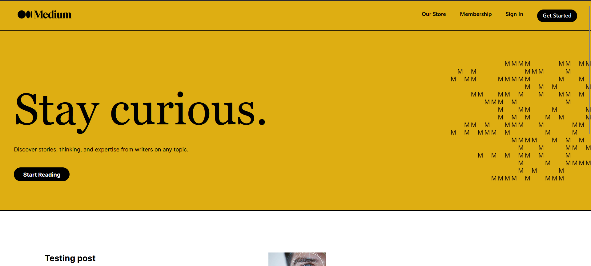

# Medium-clone

This project is a clone of the popular online publishing platform that allows writers and content creators to share their stories, articles, essays, and opinions with a wide audience.

# Next.js

Next.js is a react **framework** that gives you building blocks to create web applications.

By framework, we mean Next.js handles the tooling and configuration needed for React, and provides additional structure, features, and optimizations for your application.

You can use React to build your UI, then incrementally adopt Next.js features to solve common application requirements such as routing, data fetching, integrations - all while improving the developer and end-user experience.


```bash
  npx create-next-app@latest 
```
Documentation - [nextjs.org/docs](https://nextjs.org/docs)

# tailwindcss

I used tailwindcss to generate styling for the components in the website and make the application responsive.

Installation for a Nextjs application - [tailwindcss.com/docs/guides/nextjs](https://tailwindcss.com/docs/guides/nextjs)

# Backend

For the database I used Firebase to make the required schemas and adding documents into it.


There are two collections 
1. articles -> which store all the posts.
2. users -> which stores all the users.


A new entry to the articles collections is made when a new post is added in the database.

A new new entry intot he users collection is  made when a new user is registered using OAuth.


# Working

In order to write a post into the database the user first need to sign in




Then Click on the 'Write' icon in the navbar to write a new post. A new window will open 


fill the fields with you data and click submit.

Close the window by clicking away from the window and refresh the page. 

The new post will appear in the post list section


Click on the post and it will redirect you to a different page where you will be able to view the full post 


